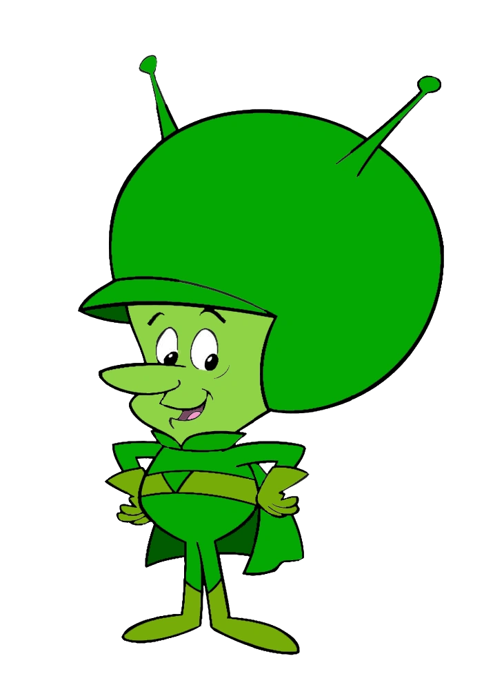

<div align="center">
  

  # Gazoo

  **Make a remote Minecraft: Bedrock Edition server show up as a LAN game on your console.**

  [](https://github.com/mauroartizzu/gazoo/actions/workflows/release.yml)
  [](https://github.com/mauroartizzu/gazoo/releases/latest)

  [Project page](https://mauroartizzu.github.io/gazoo/) · [Releases](https://github.com/mauroartizzu/gazoo/releases)
</div>

---

## Why this exists

My kids wanted to play Minecraft with their friends on a shared server — but consoles only join servers that show up as LAN games, and every existing way around that was either hacky to set up or buried in an app full of ads. So I built our own: a clean, simple relay that just works.

**Gazoo is free, and will always be free. No ads, no telemetry, no "premium" tier. Ever.**

It's also a learning project: I made it to study **Dart and Flutter** and to explore what it takes to build one codebase that genuinely runs across Windows, macOS, Linux, Android, and iOS. Most of the code was written with [Claude](https://claude.com) (Anthropic's AI assistant) — the architecture, protocol work, tests, and iterations were done together with it as a way of studying the language and the cross-platform toolchain. If you're learning Flutter yourself, the codebase is intentionally small and layered, and you're welcome to dig through it.

## What it does

Xbox and PlayStation only let you join Minecraft Bedrock servers that appear as a **LAN game** on your local network. Gazoo answers the console's RakNet LAN-discovery broadcast on your device's behalf, then transparently relays all UDP traffic between the console and the real remote server — no server-side changes required.

Point it at any Minecraft Bedrock server (a friend's box, a VPS, a hosting provider), start the relay, and your console sees it as if it were sitting right there on the network.

## Features

- **Multi-server support** — advertise several saved servers at once, each demuxed onto its own dedicated proxy port
- **Live status** — see player count, ping, and online/offline state for each saved server without starting a relay
- **Cross-platform GUI** — Windows, macOS, Linux, with a responsive desktop/mobile layout (Android/iOS builds are available but background platform glue is still in progress — see [Status](#status))
- **Headless CLI mode** — `gazoo --headless --server=host:port` for running on a machine with no display
- **No ads, no telemetry, no analytics** — the relay traffic is the only network activity this app performs

## Download

Grab the latest build for your platform from the [Releases page](https://github.com/mauroartizzu/gazoo/releases/latest), or the direct links below (always point at the newest release). Each release also includes a `SHA256SUMS.txt` — verify a download with `shasum -a 256 -c SHA256SUMS.txt` (macOS/Linux) or `certutil -hashfile <file> SHA256` (Windows).

| Platform | Download |
|---|---|
| Windows | [gazoo-windows.zip](https://github.com/mauroartizzu/gazoo/releases/latest/download/gazoo-windows.zip) |
| macOS | [gazoo-macos.zip](https://github.com/mauroartizzu/gazoo/releases/latest/download/gazoo-macos.zip) |
| Linux | [gazoo-linux.zip](https://github.com/mauroartizzu/gazoo/releases/latest/download/gazoo-linux.zip) |
| Android | [gazoo-android-debug.apk](https://github.com/mauroartizzu/gazoo/releases/latest/download/gazoo-android-debug.apk) (debug build) |
| iOS | [gazoo-ios-unsigned.zip](https://github.com/mauroartizzu/gazoo/releases/latest/download/gazoo-ios-unsigned.zip) (unsigned, dev-only) |

**Requirement:** your console and the device running Gazoo must be on the same Wi-Fi/local network. On first run, desktop platforms may prompt to allow incoming network connections (firewall) — accept it, or the console won't be able to reach the relay.

## Status

| Layer | State |
|---|---|
| Core relay engine (RakNet discovery + multi-server UDP proxy) | ✅ Done, unit-tested |
| Desktop GUI (server list, live relay status, settings, onboarding) | ✅ Done |
| Headless CLI mode | ✅ Done |
| Android foreground service / multicast lock | 🚧 Not yet implemented |
| iOS `Network.framework` fallback validation | 🚧 Not yet implemented |

Windows, macOS, and Linux are fully functional today. Android and iOS builds compile and are attached to every release for testing, but keep the app in the foreground while playing on mobile until the background platform glue lands.

## Building from source

```bash
flutter pub get
flutter test         # run the test suite
flutter run -d macos # or windows / linux / an attached device
```

Headless mode:

```bash
flutter build macos   # or windows/linux
./build/macos/Build/Products/Release/gazoo.app/Contents/MacOS/gazoo \
  --headless --server=example.com:19132
```

## How it works

The console's RakNet **Unconnected Ping** broadcast to UDP port `19132` is answered with an **Unconnected Pong** advertising each enabled saved server on its own dedicated port. Whichever port the console then connects to unambiguously identifies which real server it picked — after that handshake, Gazoo is a protocol-agnostic byte-for-byte UDP relay between the console and the real server.

## Contributing

Issues and PRs welcome — see [CONTRIBUTING.md](CONTRIBUTING.md) for the ground rules and project layout, and [CHANGELOG.md](CHANGELOG.md) for release history. This project has no ads, no telemetry, and no analytics — contributions that add any of those won't be accepted. Security issues: see [SECURITY.md](SECURITY.md).

## About the name

This project is named after **The Great Gazoo**, the small green alien character from Hanna-Barbera's *The Flintstones* — chosen because Gazoo, like the character, quietly makes something appear where it technically isn't (a remote server showing up as if it were on your LAN).

**This project is an independent fan homage and is not affiliated with, endorsed by, or sponsored by Hanna-Barbera, Warner Bros., or any of their affiliates.** "The Great Gazoo," *The Flintstones*, and all related characters and artwork are trademarks and copyrights of their respective owners, who retain all rights to them. The mascot image used in this repository belongs to its original rights holders and is used here informally, not commercially.

## License

See [LICENSE](LICENSE).

---

<sub>"Gazoo" and the mascot artwork reference *The Great Gazoo* from Hanna-Barbera's *The Flintstones*, used here as an affectionate nod — this project is not affiliated with or endorsed by Hanna-Barbera or Warner Bros.</sub>
